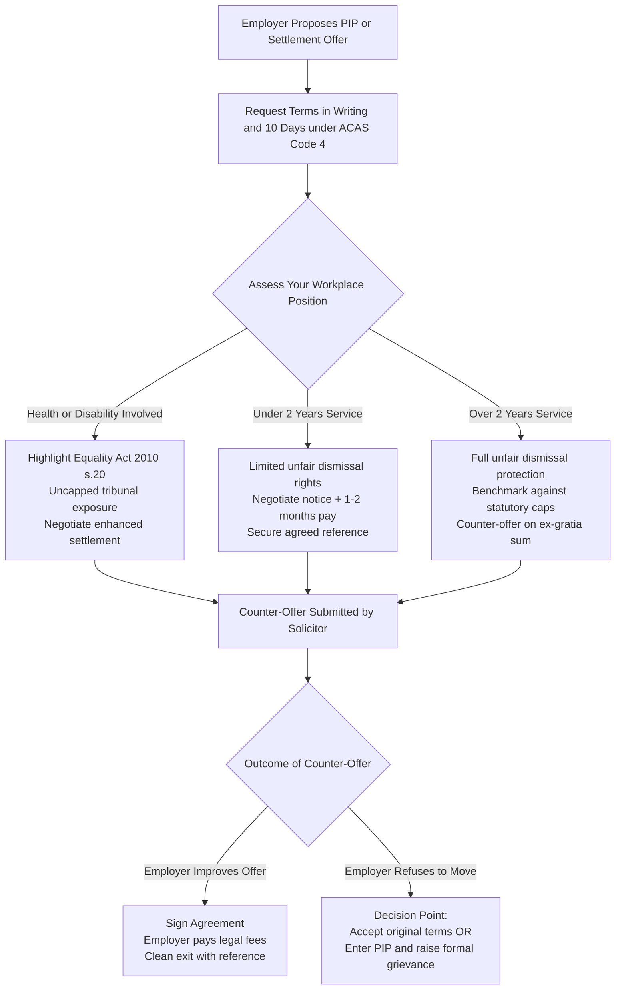

SEO title: Settlement Agreement Instead of a PIP: UK Guide (2026 Rules)
Meta description: Offered a settlement agreement instead of a PIP? Check 2026 statutory caps (£751/week), tax rules, negotiation scripts, and how to secure a fair exit.
Slug: /guides/settlement-agreement-instead-of-pip
Target keywords: settlement agreement instead of pip, pip settlement agreement uk, settlement agreement performance improvement plan, negotiating settlement agreement pip
Word count: ~2,400 words

# Settlement Agreement Instead of a PIP: The UK Employee Guide (2026 Rules)

Being offered a settlement agreement instead of a Performance Improvement Plan (PIP) is a frequent workplace scenario in the UK. Under the Employment Rights (Increase of Limits) Order 2026 ([SI 2026/310](https://www.legislation.gov.uk/uksi/2026/310/contents/made)), statutory weekly pay is capped at £751 in Great Britain. When your employer offers an agreed exit rather than a PIP, they want a clean departure without tribunal risk.

This guide explains why employers offer settlement agreements instead of PIPs. It covers your statutory rights, 2026 payout benchmarks, and practical negotiation scripts to secure a fair financial exit.

Figures on this page reflect the Employment Rights (Increase of Limits) Order 2026 (SI 2026/310), in force from 6 April 2026. Last reviewed: October 2026.

[Calculate my estimate →](/calculator/)

---

## Why employers offer a settlement agreement instead of a PIP

In many UK workplaces, a Performance Improvement Plan is rarely about genuine professional development. HR professionals often treat a PIP as a formal process to manage an employee out of the business. Industry surveys indicate that fewer than one in five employees successfully complete a PIP and remain long-term.

Running a lawful capability process requires significant time and commercial expense. Under the [ACAS Code of Practice 1 on Disciplinary and Grievance Procedures](https://www.acas.org.uk/code-of-practice-disciplinary-and-grievance-procedures), your employer must follow strict procedural standards before dismissing you for poor performance:

- They must set realistic, measurable targets with objective assessment criteria.
- They must provide adequate training, resources, and regular review meetings.
- They must give you reasonable timescales to demonstrate sustained improvement.
- They must issue formal written warnings before considering dismissal.

This capability pathway consumes months of management time and internal HR resources. It also creates operational disruption across the team.

Employees placed on a PIP frequently submit formal grievances regarding unfair treatment, unreasonable workloads, or lack of management support. Under ACAS standards, your employer must investigate that grievance, which pauses the PIP process.

Furthermore, employees under the intense stress of a PIP often take certified medical leave for work-related anxiety or depression. Sick leave freezes the capability timeline for weeks or months.

Offering a settlement agreement under [Section 203 of the Employment Rights Act 1996](https://www.legislation.gov.uk/ukpga/1996/18/section/203) allows your employer to avoid these delays. By agreeing a financial exit, your employer eliminates weeks of administrative work. Crucially, a signed agreement waives your right to bring an employment tribunal claim. Your employer buys absolute commercial certainty and legal peace of mind.

---

## Protected conversations vs Without Prejudice: What happened in your meeting?

When your manager or HR representative invited you to a meeting to discuss your performance, they likely initiated a confidential discussion. Understanding the legal rules governing this discussion protects your position.

In UK employment law, confidential exit conversations fall under two distinct frameworks: statutory protected conversations and the common law Without Prejudice rule.

| Legal Feature | Section 111A Protected Conversation | Common Law Without Prejudice |
| :--- | :--- | :--- |
| **Legal Basis** | [ERA 1996 s.111A](https://www.legislation.gov.uk/ukpga/1996/18/section/111A) | Common law court precedent |
| **Dispute Required?** | No. Your employer can start talks at any time. | Yes. Requires an existing, active legal dispute. |
| **Protected Claims** | Ordinary unfair dismissal only ([ERA 1996 s.94](https://www.legislation.gov.uk/ukpga/1996/18/section/94)). | Most civil claims and employment tribunal causes of action. |
| **Unprotected Claims** | Discrimination, whistleblowing, breach of contract. | Fraud, perjury, unambiguous impropriety. |
| **Loss of Protection** | Improper behaviour by either party ([ERA 1996 s.111A(4)](https://www.legislation.gov.uk/ukpga/1996/18/section/111A)). | Severe abuse of privilege. |

### Section 111A pre-termination negotiations

Under [Section 111A of the Employment Rights Act 1996](https://www.legislation.gov.uk/ukpga/1996/18/section/111A), your employer can propose an exit package confidentially. No prior conflict or performance dispute is required.

Conversations held under Section 111A remain confidential during an ordinary unfair dismissal case. Neither you nor your employer can tell an employment tribunal about the financial offers discussed in the room.

However, Section 111A protection is narrow. It applies solely to ordinary unfair dismissal claims. It does not cover allegations of unlawful discrimination under the Equality Act 2010, whistleblowing disclosures, or breach of contract.

### Common law Without Prejudice

The Without Prejudice rule is an established common law principle. It prevents written or verbal statements made in a genuine attempt to settle an existing dispute from being put before a court or tribunal.

Without Prejudice only applies if an actual legal dispute already exists between you and your employer. If you have not submitted a grievance, faced formal capability proceedings, or commenced ACAS Early Conciliation, no dispute exists.

If your employer mentions "Without Prejudice" during your initial meeting, that label may be legally invalid. The conversation is governed by Section 111A instead.

### Improper behaviour lifts confidentiality

Section 111A confidentiality is not absolute. Under [Section 111A(4) of the Employment Rights Act 1996](https://www.legislation.gov.uk/ukpga/1996/18/section/111A), an employment tribunal will admit evidence of the discussions if your employer engages in improper behaviour.

Examples of improper behaviour include:

- Threatening dismissal before any formal capability process has commenced.
- Demanding that you sign an agreement by the end of the working day.
- Using aggressive, demeaning, or intimidating language during the meeting.
- Imposing financial penalties if you take time to seek independent legal advice.

If your manager states, "Sign this agreement today or you will be fired on Friday," they have engaged in improper behaviour. That ultimatum removes Section 111A protection. An employment tribunal can hear that statement as evidence of unfair dismissal.

---

## The ACAS 10-day consideration rule

Employers often create an artificial sense of urgency during exit discussions. Your employer may tell you that the settlement offer expires within 24 or 48 hours.

This pressure is a common negotiation tactic designed to make you accept an offer before discovering your legal entitlements.

Paragraph 12 of the [ACAS Code of Practice 4 on Settlement Agreements](https://www.acas.org.uk/code-of-practice-settlement-agreements) directly protects employees from this pressure:

> "Parties should be allowed a reasonable period of time to consider the proposed terms of a settlement agreement. As a general rule, a minimum period of 10 calendar days should be allowed to consider the written terms and to obtain independent legal advice, unless the parties agree otherwise."

Key protections under the ACAS 10-day rule:

- The 10-day period begins on the day you receive the written settlement agreement, not during your verbal meeting.
- The 10 days are calendar days, which include weekends and bank holidays.
- Refusing to grant a reasonable consideration period can be viewed by a tribunal as improper behaviour under Section 111A(4).

If your employer imposes a tight deadline, you have the right to request the standard 10 calendar days recommended by ACAS.

---

## Equality Act 2010: When a PIP creates uncapped tribunal risk

Many workplace performance concerns arise from underlying health issues, life transitions, or neurodivergent conditions.

Under [Section 6 of the Equality Act 2010](https://www.legislation.gov.uk/ukpga/2010/15/section/6), a disability is defined as a physical or mental impairment that has a substantial and long-term adverse effect on your ability to carry out normal day-to-day activities. Long-term means the condition has lasted, or is likely to last, for at least 12 months.

Recognised conditions under UK law include:

- Mental health conditions, such as clinical depression, severe anxiety, and post-traumatic stress disorder.
- Neurodiversity, including attention deficit hyperactivity disorder (ADHD), autism spectrum conditions, and dyslexia.
- Menopause and perimenopause symptoms that substantially impair daily cognitive function or stamina.
- Chronic physical health conditions, autoimmune disorders, and cancer.

### The duty to make reasonable adjustments

Under [Section 20 of the Equality Act 2010](https://www.legislation.gov.uk/ukpga/2010/15/section/20), your employer has a strict statutory duty to make reasonable adjustments for disabled employees.

Reasonable adjustments can include:

- Adjusting performance targets, sales quotas, or billing expectations.
- Providing flexible working arrangements, adjusted hours, or hybrid working.
- Offering assistive technology, noise-cancelling equipment, or specialist mentoring.
- Allowing extra time for tasks and rescheduling review meetings during flare-ups.

If your employer places you on a PIP without considering or implementing reasonable adjustments, they risk committing unlawful disability discrimination. Under [Section 15 of the Equality Act 2010](https://www.legislation.gov.uk/ukpga/2010/15/section/15), dismissing or disciplining an employee for performance issues arising from a disability constitutes discrimination arising from disability.

### Uncapped compensation shifts the negotiation balance

Unlike ordinary unfair dismissal awards, compensation for unlawful discrimination under [Section 124 of the Equality Act 2010](https://www.legislation.gov.uk/ukpga/2010/15/section/124) has no statutory cap.

An employment tribunal can award compensation for all financial losses resulting from discriminatory dismissal. In addition, tribunals award compensation for injury to feelings under the judicial Vento guidelines:

- Lower band (£1,200 to £11,700): For isolated or minor incidents.
- Middle band (£11,700 to £35,200): For serious cases that do not merit an award in the top band.
- Upper band (£35,200 to £58,700): For the most serious cases, such as prolonged campaigns of discriminatory treatment.

If your performance concerns relate to health or neurodiversity, your employer faces substantial legal liability. This legal exposure gives you significant strength when negotiating an exit package.

---

## Statutory compensation limits for 2026

Evaluating whether a settlement offer is fair requires benchmarking it against what an employment tribunal could award.

Statutory compensation caps are revised annually under the [Employment Rights (Increase of Limits) Order 2026 (SI 2026/310)](https://www.legislation.gov.uk/uksi/2026/310/contents/made). These rates took effect on 6 April 2026.

| Statutory Limit Type | Cap for 2026 (Great Britain) | Cap for 2026 (Northern Ireland) |
| :--- | :--- | :--- |
| **Statutory Weekly Pay Cap** | **£751** per week ([ERA 1996 s.227](https://www.legislation.gov.uk/ukpga/1996/18/section/227)) | **£783** per week (SR 2026/57) |
| **Maximum Basic Award / Redundancy Pay** | **£22,530** (20 years x 1.5 x £751) | **£23,490** (20 years x 1.5 x £783) |
| **Maximum Ordinary Unfair Dismissal Award** | **£123,543** (or 52 weeks' gross pay, lower) | **£123,543** (or 52 weeks' gross pay, lower) |
| **Discrimination Claims ([Equality Act 2010](https://www.legislation.gov.uk/ukpga/2010/15/contents))** | **Uncapped** | **Uncapped** |
| **Whistleblowing Claims ([ERA 1996 s.43A](https://www.legislation.gov.uk/ukpga/1996/18/part/IVA))** | **Uncapped** | **Uncapped** |

### Tax rules on settlement packages

Understanding tax legislation ensures you know your exact net take-home pay from a proposed settlement.

#### The £30,000 tax-free exemption

Under [Section 403 of the Income Tax (Earnings and Pensions) Act 2003 (ITEPA 2003)](https://www.legislation.gov.uk/ukpga/2003/1/section/403), genuine compensation for termination of employment is tax-free up to £30,000.

This tax exemption applies to ex-gratia compensation and statutory redundancy payments. Any ex-gratia payment above £30,000 is subject to income tax and employer Class 1A National Insurance contributions. You pay no employee National Insurance on compensation for loss of employment.

#### Notice pay is always taxable

Under [Section 402D of ITEPA 2003](https://www.legislation.gov.uk/ukpga/2003/1/section/402D), Post-Employment Notice Pay (PILON) cannot be paid tax-free.

Whether you work your notice period or receive a lump sum payment in lieu, notice pay is treated as earnings. Your employer must deduct income tax and employee National Insurance contributions from your notice pay.

Accrued but untaken statutory holiday pay is also fully taxable as general earnings.

#### Your employer pays your legal fees

Under [Section 203(3) of the Employment Rights Act 1996](https://www.legislation.gov.uk/ukpga/1996/18/section/203), you must obtain independent legal advice from a qualified solicitor for a settlement agreement to be binding.

Because advice is a mandatory legal requirement, your employer covers the cost. Employers typically contribute between £350 and £750 plus VAT directly to your solicitor.

Under HMRC concession [EIM13750](https://www.gov.uk/hmrc-internal-manuals/employment-income-manual/eim13750), this legal fee contribution is not a taxable benefit for the employee. It is paid directly to your chosen solicitor and does not count towards your £30,000 tax exemption limit.

---

## What a fair PIP settlement agreement package looks like

An initial settlement offer made instead of a PIP is frequently below the typical range. Employers often start by offering contractual notice pay plus a nominal sum.

A fair settlement package reflects the cost, time, and disruption your employer avoids by bypassing the formal capability route.

```
┌────────────────────────────────────────────────────────────────────────┐
│                   COMPONENTS OF A FAIR PIP SETTLEMENT                  │
├────────────────────────────────────────────────────────────────────────┤
│ 1. Notice Pay (PILON or Garden Leave)   → Fully taxable (s.402D)       │
│ 2. Ex-Gratia Compensation (1-3 months)  → Tax-free up to £30,000       │
│ 3. Accrued Holiday Pay                  → Fully taxable earnings       │
│ 4. Pro-Rata Bonus / Commission          → Contractual entitlement      │
│ 5. Pension Contributions on Notice      → Standard contractual rate    │
│ 6. Legal Fee Contribution (£350 to £750+) → Direct to solicitor (tax-free)│
│ 7. Agreed Positive Job Reference        → Attached as binding annex    │
│ 8. Mutual Non-Disparagement Clause      → Protects your reputation     │
└────────────────────────────────────────────────────────────────────────┘
```

A fair settlement package should contain the following components:

### 1. Notice pay in full

You are legally entitled to your contractual notice period or the statutory minimum under [Section 86 of the Employment Rights Act 1996](https://www.legislation.gov.uk/ukpga/1996/18/section/86). This can be paid as a lump sum under PILON or served on paid garden leave.

### 2. Ex-gratia compensation payment

This payment compensates you for the loss of your employment. In PIP situations, a reasonable ex-gratia payment covers the time a fair capability procedure would have taken, typically one to three months of gross salary, plus transition time to find a new role.

This payment is paid free of tax and National Insurance up to £30,000 under ITEPA 2003 s.403.

### 3. Accrued untaken holiday pay

You must be paid for all accrued but untaken statutory and contractual holiday up to your final termination date.

### 4. Pro-rata bonus or commission

If you are eligible for an annual performance bonus or accrued sales commissions, negotiate for your pro-rata entitlement up to your exit date.

### 5. Pension contributions across notice

Your employer should maintain pension contributions across your contractual notice period, or pay an equivalent lump sum into your pension pot.

### 6. Employer legal fee contribution

Your agreement must provide a contribution of £350 to £750 plus VAT to cover independent advice from a solicitor. If extensive negotiation is required, your solicitor can ask your employer to increase this fee to £1,000 plus VAT or more.

### 7. Agreed written reference

In the UK, employers have no general legal obligation to provide a detailed job reference. However, a settlement agreement can include an agreed reference clause.

The agreed reference text is attached to the agreement as an annex. Your employer commits contractually to providing this exact wording when prospective employers make enquiries.

### 8. Mutual non-disparagement and announcements

The agreement should include mutual non-disparagement clauses. This ensures that managers and colleagues do not make derogatory comments about your capability after your departure.

You should also agree the exact wording and timing of an internal departure announcement to your team and clients.

---

## Decision framework: PIP vs Settlement Agreement

Deciding whether to undergo a PIP or accept an agreed financial exit is a critical career choice.

Use this comparison table to assess both paths objectively:

| Decision Factor | Undergoing the PIP | Accepting a Settlement Agreement |
| :--- | :--- | :--- |
| **Financial Security** | Regular salary during the PIP, but sudden loss of income if dismissed at the end. | Guaranteed tax-free compensation package and notice pay paid upfront. |
| **Mental Health and Stress** | High sustained stress, intense weekly scrutiny, and damaged team relationships. | Immediate relief, closure, and emotional space to focus on career progression. |
| **Career Reputation** | Dismissal for capability goes on your internal HR record. Reference may be poor or refusal. | Agreed positive reference attached to the contract. Clean, dignified exit. |
| **Likelihood of Success** | Statistically low. Less than 20% of employees pass a formal capability plan. | 100% certainty over departure terms and agreed narrative. |
| **Time and Energy** | Weeks spent compiling evidence, attending hearings, and disputing targets. | Energy directed entirely toward job hunting, networking, and interviewing. |
| **Legal Recourse** | You retain the right to bring an employment tribunal claim after dismissal. | You waive legal claims in exchange for financial compensation. |

### The decision workflow



For most employees, accepting a negotiated settlement agreement is the most practical choice. It protects your mental health, preserves your professional reputation, and provides financial support while you secure your next position.

However, if you have strong evidence that the performance allegations are entirely fabricated, and you wish to remain with the employer, you can contest the PIP formally. You can submit a formal grievance under the ACAS Code of Practice 1, citing unfair targets or lack of support.

---

## Verbatim negotiation scripts for UK employees

During exit conversations, knowing exactly what to say prevents emotional reactions and protects your legal rights.

Use these verbatim scripts in meetings and written correspondence.

### Script 1: In the initial meeting (asking for terms in writing)

Use this script when your manager or HR representative first presents the PIP or suggests an agreed exit.

> "Thank you for explaining your perspective. Given that this is an unexpected discussion, I am not in a position to discuss terms or make decisions today.
> 
> Please send the draft settlement agreement and the complete financial proposal to me in writing by email. Under the ACAS Code of Practice 4, I will take the recommended 10 calendar days to review the terms and take independent legal advice.
> 
> In the meantime, please clarify whether you expect me to continue my day-to-day duties or take paid leave while I review the document."

### Script 2: If your employer sets an artificial deadline

Use this script if your manager tells you that you have 24 or 48 hours to sign, or warns that the offer will be withdrawn.

> "I recognise your wish to resolve this quickly. However, paragraph 12 of the ACAS Code of Practice 4 on Settlement Agreements establishes that employees should receive a minimum of 10 calendar days to consider written settlement terms and obtain independent legal advice.
> 
> Imposing an immediate deadline prevents me from taking proper legal advice. I am actively arranging an appointment with an independent employment solicitor. I will provide my considered response within the standard ACAS timeframe."

### Script 3: Written counter-proposal for higher compensation

Use this email script to counter-offer after reviewing the initial financial proposal.

> **Subject:** Strictly Private and Confidential: Without Prejudice / Protected Conversation under Section 111A ERA 1996
> 
> Dear [Manager / HR Name],
> 
> Thank you for forwarding the draft settlement agreement.
> 
> I have reviewed the initial proposal. The current offer of notice pay and [insert initial offer amount] does not adequately reflect my length of service, my past contributions, or the time required to complete a formal capability process under the ACAS Code of Practice 1.
> 
> To achieve a clean, amicable, and mutually agreed departure without proceeding to formal capability reviews or grievance procedures, I am prepared to sign the agreement on the following adjusted terms:
> 
> 1. Payment of contractual notice pay in full under PILON ([number] months gross pay).
> 2. An ex-gratia compensation payment of £[insert amount, e.g. 2 to 3 months gross salary] paid free of tax and National Insurance under Section 403 of ITEPA 2003.
> 3. Payment for all accrued but untaken holiday up to the termination date.
> 4. An agreed positive job reference, with the wording annexed to the settlement agreement.
> 5. An employer legal fee contribution of £500 plus VAT, paid directly to my independent solicitor.
> 
> If you agree to these terms, I will instruct my solicitor to sign off the agreement promptly.
> 
> Yours sincerely,
> 
> [Your Name]

### Script 4: Written email when health, disability, or reasonable adjustments are involved

Use this script if your performance concerns relate to a medical condition, mental health, menopause, or neurodiversity.

> **Subject:** Strictly Private and Confidential: Without Prejudice / Protected Conversation under Section 111A ERA 1996
> 
> Dear [Manager / HR Name],
> 
> I write regarding our recent discussion concerning my performance and the proposed exit terms.
> 
> As you are aware, I have been managing [mention condition: e.g. depression, ADHD, chronic illness], which meets the statutory definition of a disability under Section 6 of the Equality Act 2010.
> 
> The recent performance concerns raised directly stem from the impact of this condition. To date, my employer has not carried out an occupational health assessment or implemented reasonable adjustments under Section 20 of the Equality Act 2010.
> 
> Placing an employee on a capability plan without making reasonable adjustments raises serious issues under Section 15 of the Equality Act 2010.
> 
> I wish to resolve this situation professionally and amicably. However, the current financial proposal does not reflect the legal risks associated with an unadjusted capability process.
> 
> To conclude matters on an agreed basis, I propose an ex-gratia compensation payment of £[insert enhanced amount, e.g. 3 to 6 months gross salary] in addition to my full contractual notice pay, alongside an agreed reference and the standard employer legal fee contribution.
> 
> I look forward to your response.
> 
> Yours sincerely,
> 
> [Your Name]

---

## Step-by-step checklist after receiving an offer

Follow this structured checklist to protect your rights from the moment a settlement agreement is proposed:

1. **Remain calm and composed in the room**: Do not resign, do not admit fault, and do not accept the verbal offer immediately.
2. **Request everything in writing**: Ask for the formal draft agreement and the full financial breakdown to be emailed to your personal email address.
3. **Assert your ACAS 10-day right**: Ensure you have the recommended 10 calendar days to evaluate the proposal without undue pressure.
4. **Gather your workplace evidence**: Download copies of your employment contract, recent performance appraisals, praise from clients or colleagues, and relevant medical records to a personal device.
5. **Benchmark your legal entitlements**: Calculate your statutory notice pay, redundancy baseline, and unfair dismissal limits using our calculator.
6. **Instruct an independent employment solicitor**: Choose a specialist solicitor who acts solely in your interests. Your employer covers the fees for this advice.
7. **Submit a structured counter-proposal**: Use the negotiation scripts above to seek an increased ex-gratia amount, pension contributions, and an agreed reference.
8. **Sign the final agreement**: Once agreed, your solicitor will sign the adviser certificate, and your employer will process your payments.

---

## Frequently asked questions

### Can my employer dismiss me immediately if I reject the settlement agreement?
No. An employer cannot lawfully dismiss you on the spot simply because you reject a settlement offer. If you decline the offer, your employment continues as normal. Your employer must then follow a fair capability procedure under the ACAS Code of Practice 1 before considering dismissal.

### What happens if I have less than two years of continuous service?
Under Section 108 of the Employment Rights Act 1996, you generally need two years of continuous service to bring an ordinary unfair dismissal claim. If you have under two years of service, your employer can dismiss you with notice without full capability procedures. However, the two-year rule does not apply if your dismissal involves unlawful discrimination under the Equality Act 2010 or whistleblowing.

### How much should I ask for when negotiating a PIP settlement?
A realistic counter-offer typically requests full contractual notice pay plus two to three months of gross salary as tax-free ex-gratia compensation. This figure mirrors the time and expense your employer saves by avoiding a formal two to three month PIP. If disability or discrimination is involved, counter-offers can be significantly higher.

### Do I have to pay my solicitor anything out of my own pocket?
No. Your employer covers the fees for independent legal advice on the settlement agreement. The standard contribution is £350 to £750 plus VAT. If your solicitor requires a higher fee to negotiate improvements, they will ask your employer to increase the contribution.

### What happens to my job reference if I sign a settlement agreement?
Your settlement agreement will include an agreed reference clause. The exact wording of the reference is attached as a schedule to the agreement. Your employer is contractually bound to provide that reference to future employers and cannot give a negative verbal reference.

### Will signing a settlement agreement stop me from claiming benefits?
A settlement agreement does not prevent you from claiming statutory benefits such as Universal Credit or Jobseeker's Allowance. The Department for Work and Pensions treats a departure under a settlement agreement as a mutual exit rather than voluntary resignation, provided the agreement settled an employment dispute.

---

## Check your settlement entitlement today

Do not accept an exit package without knowing what your employment rights are worth under UK law.

Use our free settlement calculator to check statutory pay caps, calculate notice entitlements, and benchmark your offer against 2026 rates.

[Calculate my estimate →](/calculator/)

---

SettlementCheck is an independent introduction service. We are not a law firm and we do not provide legal advice. All solicitors on our panel are independently SRA-regulated.
