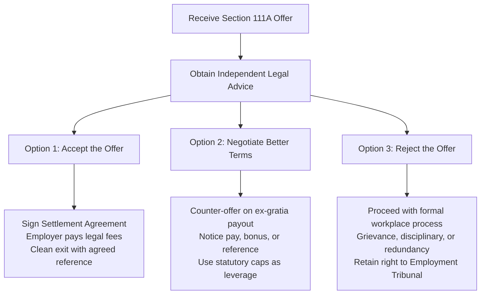

SEO title: Protected Conversations and Without Prejudice: UK Employee Guide (2026 Rules)
Meta description: What is a protected conversation? Learn how Section 111A and Without Prejudice work in UK employment law, what to say, and how to check your settlement offer.
Slug: /guides/protected-conversations-without-prejudice
Target keywords: protected conversation uk, without prejudice settlement agreement, section 111a employment rights act, protected conversation rules 2026
Word count: ~1,800 words

# Protected Conversations and Without Prejudice: The UK Employee Guide (Section 111A)

A protected conversation allows an employer and employee to hold confidential settlement discussions without those discussions being disclosed in an ordinary unfair dismissal employment tribunal claim. Governed by [Section 111A of the Employment Rights Act 1996](https://www.legislation.gov.uk/ukpga/1996/18/section/111A), it lets employers propose an exit package even when no dispute exists.

If your manager calls you into an unexpected meeting, mentions "Section 111A", or hands you a document marked "Without Prejudice", you may feel alarmed. That reaction is completely natural.

You are not required to accept their proposal on the spot. You have statutory rights, clear legal protections, and time to consider your position. 

This guide explains the difference between Section 111A and Without Prejudice, when confidentiality fails, and what practical steps you should take today.

---

## What is a protected conversation under Section 111A?

A protected conversation is a legal mechanism introduced under [Section 111A of the Employment Rights Act 1996](https://www.legislation.gov.uk/ukpga/1996/18/section/111A). The law refers to these talks as "pre-termination negotiations".

In simple terms, it allows your employer to speak to you confidentially about leaving your job under a settlement agreement. 

Before Section 111A took effect in 2013, an employer could only hold confidential exit discussions if a legal dispute was already underway. Section 111A changed this rule.

An employer can now initiate an exit conversation out of the blue. They do not need to start a disciplinary investigation, raise a formal performance review, or wait for you to submit a grievance.

If both parties negotiate, the details of the offer remain confidential. Neither you nor your employer can refer to the discussion during an employment tribunal claim for ordinary unfair dismissal.

---

## Section 111A vs Common Law "Without Prejudice": What is the difference?

Employers often confuse Section 111A pre-termination negotiations with the common law principle of "Without Prejudice". While both rules protect confidential discussions, they operate under different legal principles.

| Legal Feature | Section 111A Protected Conversation | Common Law Without Prejudice |
| :--- | :--- | :--- |
| **Legal Basis** | [Section 111A Employment Rights Act 1996](https://www.legislation.gov.uk/ukpga/1996/18/section/111A) | Common law principle established by court decisions |
| **Existing Dispute Required?** | No. Can be initiated at any time without prior conflict. | Yes. Requires an ongoing, genuine legal dispute between the parties. |
| **Tribunal Claims Covered** | Ordinary unfair dismissal only ([ERA 1996 s.94/s.98](https://www.legislation.gov.uk/ukpga/1996/18/section/94)). | Wide range of claims, including discrimination and breach of contract. |
| **Claims Not Covered** | Discrimination, whistleblowing, breach of contract, wrongful dismissal. | Discussions made to conceal perjury, fraud, blackmail, or unambiguous impropriety. |
| **Exceptions to Secrecy** | Improper behaviour by either party ([ERA 1996 s.111A(4)](https://www.legislation.gov.uk/ukpga/1996/18/section/111A)). | Unambiguous impropriety (rare and serious wrongdoing). |

### 1. The existing dispute requirement

Common law Without Prejudice only applies if there is already an existing dispute. 

An existing dispute means both sides have adverse legal positions. Examples include:
- You have submitted a formal written grievance that remains unresolved.
- Your employer has commenced a formal disciplinary process against you.
- Either party has contacted ACAS to begin Early Conciliation.

If your employer calls you into a room without warning and says the meeting is "Without Prejudice", that label may be legally invalid. Without an existing dispute, the common law rule does not apply. The discussion may only be protected under Section 111A, provided it meets statutory criteria.

### 2. The scope of tribunal protection

The biggest difference lies in the legal claims covered:
- **Common law Without Prejudice** shields discussions from almost all types of employment tribunal claims, including discrimination and breach of contract.
- **Section 111A** provides narrow protection. It shields discussions **only** from ordinary unfair dismissal claims under Section 94 and Section 98 of the Employment Rights Act 1996.

---

## Where Section 111A offers NO protection

Section 111A is not an absolute shield for employers. It has strict statutory limits.

If your case involves legal claims beyond ordinary unfair dismissal, the conversation loses its confidentiality. You can bring details of the conversation directly before an employment tribunal in the following scenarios:

### 1. Unlawful discrimination under the Equality Act 2010

Section 111A does not cover claims brought under the [Equality Act 2010](https://www.legislation.gov.uk/ukpga/2010/15/contents). 

If you face dismissal or mistreatment related to a protected characteristic, the conversation is admissible as evidence. Protected characteristics include:
- Disability (including mental health conditions, neurodiversity, and cancer).
- Sex, pregnancy, and maternity.
- Race, nationality, and ethnic origin.
- Age, sexual orientation, religion, or belief.

Unlike unfair dismissal awards, compensation for unlawful discrimination under [Section 124 of the Equality Act 2010](https://www.legislation.gov.uk/ukpga/2010/15/section/124) is completely uncapped. Tribunals can also award substantial sums for injury to feelings under the Vento guidelines.

### 2. Whistleblowing (Protected Disclosures)

Under [Sections 43A to 43L of the Employment Rights Act 1996](https://www.legislation.gov.uk/ukpga/1996/18/part/IVA), workers who disclose wrongdoing, regulatory breaches, or health and safety risks are legally protected whistleblowers. 

If your employer initiates a protected conversation after you blow the whistle, Section 111A does not apply. Compensation for whistleblowing dismissals is also completely uncapped.

### 3. Automatically unfair dismissal

Section 111A only applies to ordinary unfair dismissal. It does not apply to automatically unfair dismissals, which include:
- Dismissal for trade union membership or activities.
- Dismissal for exercising statutory family leave rights (maternity, paternity, adoption).
- Dismissal for asserting statutory employment rights, such as requesting the National Minimum Wage or statutory rest breaks.

### 4. Breach of contract and wrongful dismissal

Section 111A does not protect discussions in claims relating to breach of contract or wrongful dismissal (such as failure to pay statutory or contractual notice).

---

## What is "Improper Behaviour" under Section 111A(4)?

Even in ordinary unfair dismissal cases, an employer loses Section 111A protection if they engage in "improper behaviour". 

Under [Section 111A(4) of the Employment Rights Act 1996](https://www.legislation.gov.uk/ukpga/1996/18/section/111A), if an employer acts improperly during negotiations, an employment tribunal can lift confidentiality. The tribunal will admit evidence of the discussions to the extent it considers just.

The [ACAS Code of Practice 4 on Settlement Agreements](https://www.acas.org.uk/code-of-practice-settlement-agreements) sets out clear standards for improper behaviour.

### Examples of improper behaviour include:

1. **Unlawful harassment, bullying, or intimidation**: Using aggressive language, belittling you, or attempting to force an immediate signature.
2. **Victimisation**: Treating you unfavourably because you refused an initial verbal offer.
3. **Physical assault or threats of physical assault**.
4. **Presenting unyielding ultimatums**: Setting unreasonable deadlines to accept an offer before you can consult an adviser.
5. **Preempting a disciplinary outcome**: Telling you: *"Sign this agreement by 5 pm or we will dismiss you for gross misconduct tomorrow"*.

Employers are entitled to explain what will happen if an agreement is not reached. For example, they can state neutrally that formal performance management may follow. 

However, they cannot state categorically that you will be dismissed if no formal disciplinary process has taken place. Doing so constitutes improper behaviour.

If your employer has subjected you to improper behaviour, read our detailed guide on [what to do when pressured to sign a settlement agreement](/guides/pressured-to-sign/).

---

## The ACAS 10-day consideration rule

Employers frequently attempt to rush settlement negotiations. A manager might state that an offer expires within 24 or 48 hours.

Paragraph 12 of the [ACAS Code of Practice 4](https://www.acas.org.uk/code-of-practice-settlement-agreements) addresses this pressure directly:

> *"Parties should be allowed a reasonable period of time to consider the proposed terms of a settlement agreement. As a general rule, a minimum period of 10 calendar days should be allowed to consider the written terms and to obtain independent legal advice, unless the parties agree otherwise."*

Key aspects of this rule:
- The 10-day period begins when you receive the written settlement agreement, not when you have the initial conversation.
- The 10 days are calendar days, not working days.
- Imposing an unreasonable deadline can be cited as improper behaviour under Section 111A(4).

If your employer sets a tight deadline, write back politely requesting the standard 10 calendar days recommended by ACAS to obtain independent legal advice.

---

## Statutory compensation limits for 2026

When evaluating any settlement offer, you need to know what an employment tribunal could award if you brought a claim. 

Statutory compensation caps are updated annually. Under the [Employment Rights (Increase of Limits) Order 2026 (SI 2026/310)](https://www.legislation.gov.uk/uksi/2026/310/contents/made), the following statutory rates apply:

| Statutory Limit Type | Cap for 2026 (Great Britain) | Cap for 2026 (Northern Ireland) |
| :--- | :--- | :--- |
| **Statutory Weekly Pay Cap** | **£751** per week | **£783** per week (SR 2026/57) |
| **Maximum Basic Award / Statutory Redundancy Pay** | **£22,530** (20 years × 1.5 × £751) | **£23,490** (20 years × 1.5 × £783) |
| **Maximum Compensatory Award (Ordinary Unfair Dismissal)** | **£123,543** (or 52 weeks' gross pay, whichever is lower) | **£123,543** (or 52 weeks' gross pay, whichever is lower) |
| **Discrimination Claims ([Equality Act 2010](https://www.legislation.gov.uk/ukpga/2010/15/contents))** | **Uncapped** | **Uncapped** |
| **Whistleblowing Claims ([ERA 1996 s.43A](https://www.legislation.gov.uk/ukpga/1996/18/part/IVA))** | **Uncapped** | **Uncapped** |

An unfair dismissal compensatory award is limited to your actual financial losses. If your employer offers you only statutory redundancy pay or a basic payout, they may be undervaluing your legal claims.

You can benchmark your exact statutory redundancy pay and tribunal claim value using our [free settlement agreement calculator](/calculator/).

---

## Tax rules: The £30,000 exemption and PILON

Settlement agreements often bundle several payments together. UK tax legislation treats each component differently.

### The £30,000 tax exemption (Section 403 ITEPA 2003)

Under [Section 403 of the Income Tax (Earnings and Pensions) Act 2003 (ITEPA 2003)](https://www.legislation.gov.uk/ukpga/2003/1/section/403), genuine compensation for termination of employment can be paid tax-free up to **£30,000**.

This tax-free status applies to:
- Statutory and enhanced redundancy payments.
- Ex-gratia payments (genuine compensation for loss of office).
- Damages for breach of statutory rights.

Any compensation exceeding £30,000 is subject to Income Tax and employer Class 1A National Insurance contributions. 

For an in-depth breakdown of how this exemption functions, read our guide on the [£30,000 tax-free settlement exemption](/guides/tax-free-settlement-30000/).

### Post-Employment Notice Pay is always taxable (Section 402D ITEPA 2003)

Under [Section 402D of ITEPA 2003](https://www.legislation.gov.uk/ukpga/2003/1/section/402D), Post-Employment Notice Pay (PILON) cannot be paid tax-free. 

Whether you work your notice or receive payment in lieu, your notice pay is treated as general earnings. It is always subject to Income Tax and Class 1 National Insurance contributions.

Employers cannot reclassify your contractual notice pay or accrued holiday pay as an ex-gratia payment to avoid tax.

---

## Independent legal advice and employer fee contributions

Under [Section 203(3) of the Employment Rights Act 1996](https://www.legislation.gov.uk/ukpga/1996/18/section/203), an employee cannot waive their statutory rights without advice.

For a settlement agreement to be legally binding, you must receive advice from an independent relevant adviser. This adviser is almost always a qualified employment solicitor.

### Your employer pays your legal fees

Because independent advice is a statutory requirement, your employer will almost always pay for it. 

Employers typically contribute between **£350 and £750 plus VAT** toward your legal fees. For complex negotiations, this contribution can be higher.

Under HMRC concession [EIM13750](https://www.gov.uk/hmrc-internal-manuals/employment-income-manual/eim13750), this employer legal fee contribution is not a taxable benefit. It is paid directly to your solicitor and does not count toward your £30,000 tax-free exemption limit.

You are not required to use an adviser your company suggests. You have the legal right to appoint your own independent solicitor. Learn more about your freedom of choice in our guide on [whether you must use your employer's recommended solicitor](/guides/employer-recommended-solicitor/).

---

## What to say during a protected conversation: Meeting scripts

When an employer initiates an unexpected exit discussion, remember that you do not have to negotiate or agree immediately. 

Follow these practical steps and scripts during the meeting:

### 1. In the room: Stay calm and listen

Do not argue, admit fault, or resign. Ask for the proposal in writing.

> *"Thank you for explaining the company's position. I was not expecting this discussion today. Please provide the full proposal and draft settlement agreement in writing so I can review it carefully."*

### 2. If pressured for an instant answer

If your manager demands an immediate decision, rely on the ACAS Code of Practice.

> *"Under the ACAS Code of Practice 4, employees are entitled to a reasonable period of time to consider settlement terms. I will take the document home, review it, and take legal advice."*

### 3. Ask about next steps and working arrangements

Clarify what happens while you consider the offer.

> *"Am I expected to continue my normal duties while I consider this proposal, or is the company placing me on paid leave?"*

### 4. After the meeting: Keep detailed notes

Write a comprehensive note of everything said during the meeting as soon as you step out. Record the date, time, attendees, and any comments made, especially any ultimatums. Keep these notes on your personal device, not your work computer.

---

## What are your options next?

Once you receive a settlement offer, you have three primary paths:

### Option 1: Accept the terms
If the financial offer is generous, reflects your notice and redundancy rights, and provides an agreed job reference, accepting may be the quickest way to move forward.

### Option 2: Negotiate for improved terms
Most first offers are starting points. You can negotiate for a higher ex-gratia compensation payment, an extended notice period, a bonus, or custom reference wording. Review our guide on [how to negotiate a settlement agreement](/guides/how-to-negotiate-a-settlement-agreement/).

### Option 3: Reject the offer
You are never legally required to sign a settlement agreement. If you reject the offer, your employment continues as normal. Your employer must then follow a fair, formal process if they wish to dismiss you. Discover your rights in our guide on [what happens if you do not sign a settlement agreement](/guides/what-happens-if-you-do-not-sign/).

---

## Summary of key employee takeaways

- **Section 111A does not require an existing dispute**: An employer can open exit talks at any time.
- **Protection is strictly limited**: Section 111A protects talks against ordinary unfair dismissal claims only. Discrimination, whistleblowing, and breach of contract are not protected.
- **Improper behaviour lifts secrecy**: Ultimatums and threats of dismissal before a formal process allow you to disclose the conversation in a tribunal.
- **You are entitled to time**: ACAS recommends a minimum of 10 calendar days to review written settlement terms.
- **Your employer pays your legal fees**: You must receive independent legal advice for the agreement to be valid. Your employer covers this cost directly under HMRC rules.

---

## Check your settlement offer today

Do not sign away your employment rights without knowing their true value. 

Use our free, confidential calculator to check statutory redundancy pay, notice entitlement, and unfair dismissal caps under the 2026 rules.

[Calculate Your Settlement Value with SettlementCheck](/calculator/)
